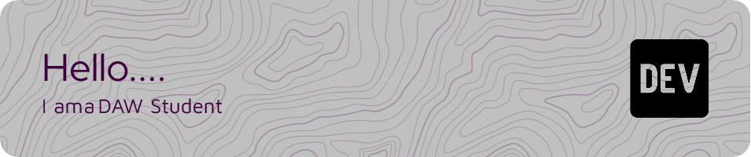

<!--
**Rufep/Rufep** is a ✨ _special_ ✨ repository because its `README.md` (this file) appears on your GitHub profile.

Here are some ideas to get you started:

- 🔭 I’m currently working on ...
- 🌱 I’m currently learning DAW
- 👯 I’m looking to collaborate on ...
- 🤔 I’m looking for help with ...
- 💬 Ask me about ...
- 📫 How to reach me: ...
- 😄 Pronouns: ...
- ⚡ Fun fact: ...
-->

Hello, I am a Daw student and here I will upload my projects with which I try to learn and improve as a web developer,  
   I love the frontend and I try to love the backend

## Languages ​​I have used

## Databases I have used

## Ides I've worked with

## Stats

